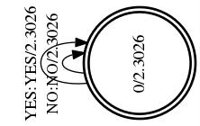

In this post, we will visualize each component of the HCLG by reviewig the building process of decoding graph for the `yesno` example located in `kaldi/egs/yesno/s5` directory.

The script `run.sh` contains pipelines to  build a complete mono-phone model including the GMM accoustic model, the HCLG decoding graph and decoding results using test data. 
First run the script. The script will also download and prepare the corpus and language related data in `data/lang`.

`$ cd kaldi/egs/yesno/s5`

`$ source run.sh`

 

## G.fst

G in HCLG represents the language model. Both input lable and output label are word-id. First let's take a look at the given LM in ARPA format:

`$  less input/task.arpabo`

>\data\\  
>ngram 1=4
>
>\1-grams: 
>-1	NO 
>-1	YES 
>-99 \<s> 
>-1 \</s>
>
>\end\

The `run.sh` scirpt calls the `local/prepare_lm.sh`, which uses the `arpa2fst` binary script to generate G.fst based on the LM: 

>`arpa2fst --disambig-symbol=#0 --read-symbol-table=$test/words.txt input/task.arpabo $test/G.fst`

Use the following command to visualize G.fst. You may have to install other dependancies according to your program output.

`$ cd data/lang_test_tg/`

`$ fstdraw --isymbols=words.txt --osymbols=words.txt G.fst | dot -Tjpg >  G.jpg`

 

To check the word-id for each word:

`less data/lang_test_tg/words.txt`

>\<eps> 0  
>\<SIL> 1  
>NO 2  
>YES 3  
>#0 4  
>\<s> 5  
>\</s> 6

 

## L.fst

L in HCLG represents the lexicon. The input lable is phone, and output lable is word. Kaldi used `utils/prepare_lang.sh` to prepare L.fst (used for training) and L_disambig.fst (used for decoding). 

To check how many phones we have:

`less phones.txt`

><eps> 0 
>SIL 1 
>Y 2 
>N 3 
>#0 4 
>#1 5

Then take a look at the L_disambig.fst:

`$ fstdraw --isymbols=phones.txt --osymbols=words.txt L_disambig.fst | dot -Tjpg >  L_disambig.jpg`

 

Given the L_disambig.fst, say we have a phone input sequence 

> \<eps> SIL #1 Y 

Then the corresponding word output sequence is 

> \<eps> \<eps> \<eps> YES 

 

## LG.fst

Now we compose L_disambig.fst and G.fst into LG.fst. The input lable is phone and output lable is word. Run the following command to generate LG.fst (actually, run.sh has generated LG.fst under `data/lang_test_tg/tmp`):

`fsttablecompose L_disambig.fst G.fst | fstdeterminizestar --use-log=true | fstminimizeencoded | fstpushspecial > LG.fst`

Then visualize LG.fst:

`fstdraw --isymbols=phones.txt --osymbols=words.txt LG.fst | dot -Tjpg >  LG.jpg`

 

 

## CLG.fst

C in HCLG means fst for context dependent phone. It's input is cd-phone, output is phone. Kaldi doesn't generate C.fst seperately, then compose with LG. Instead, it dynamically generate the context FST and compose with LG to produce CLG.fst using the `fstcomposecontext` binary.